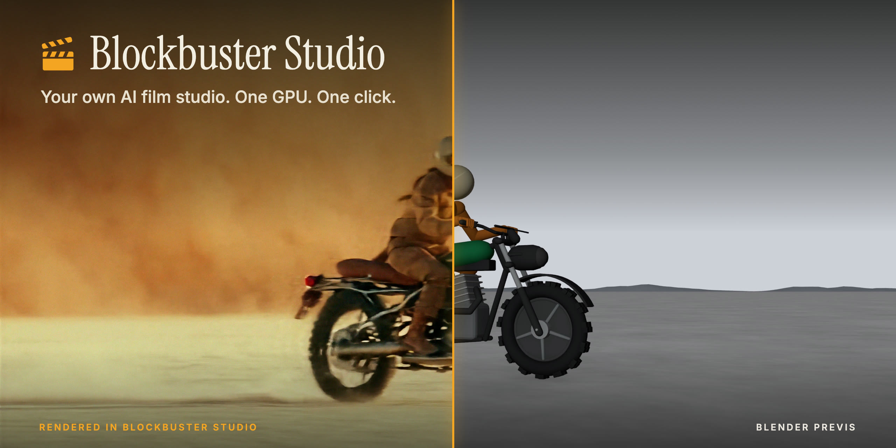

<p align="center"></p>

# Blockbuster Studio

Your own AI film studio on one rented GPU. Block out a scene, keep your characters consistent from shot to
shot, and render it with sound, up to 4K. Open models, running on a Runpod pod you control: no
subscriptions and no per-generation fees.

**[Deploy on Runpod](https://runpod.io/gsc?template=557xi57ae9&ref=48znv8n5)** · [Docs](https://docs.blockbuster.studio) · [Website](https://blockbuster.studio)

- **Create** images, video with sound (LTX-2.5), edits and new camera angles.
- **Make films** from a script, or from a Blender previs that locks every camera move and cut.
- **Stay consistent**: each scene's reference sheet keeps its cast, props and location the same in every shot.
- **Work with an AI agent**: an MCP server lets Claude Code or any MCP client make films for you.

## Get started

1. [What you need](https://docs.blockbuster.studio/requirements): a Runpod account, a Hugging Face token, and Blender or an AI agent if you use them.
2. [Quickstart](https://docs.blockbuster.studio/quickstart): deploy and make your first video in about 15 minutes.
3. [Use an AI agent](https://docs.blockbuster.studio/guides/agent): connect one and ask it for a film. Agents can read the docs at [llms.txt](https://docs.blockbuster.studio/llms.txt).

## Develop

```sh
cd app && npm install && npm run dev   # mock ComfyUI + server + web app
```

[Architecture](docs/ARCHITECTURE.md) · [API](docs/API.md) · [Operating](docs/OPERATING.md) (image, template, every environment variable)

## License

Our code is MIT ([LICENSE](LICENSE)). ComfyUI and the models keep their own licenses; see
[THIRD_PARTY_NOTICES.md](THIRD_PARTY_NOTICES.md). The studio adds no content filtering of its own, so you're
responsible for what you make and for following each model's license.
